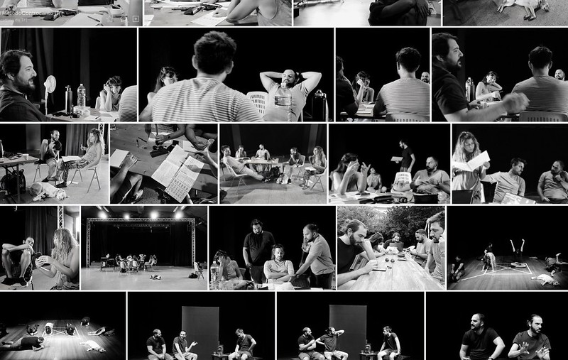

# Metodo Controcanto    

  

[Controcanto Collettivo](https://controcantocollettivo.it/) è un gruppo di sei attori romani che recitano insieme dai tempi della scuola. Gli spettacoli se li scrivono tutti da soli chiudendosi da qualche parte (lontano da famiglie ed impicci vari). Che poi gli spettacoli neanche se li scrivono veramente: li mandano a memoria a forza di prove su prove e alla fine c’è uno di loro che per penitenza sbobina il testo dal registrato (e giusto per la SIAE).
Io per capire come funziona li ho seguiti in queste loro “chiuse”.
Spoiler: non l’ho mica capito come fanno.
 
[**qui il testo**](https://docs.google.com/document/d/1QjlGbO58h9rhIr9l7X8WWTYCTQ0CrEAEWS8Ep1nxfoQ/edit?usp=sharing) + [qui altre foto](https://photos.app.goo.gl/nGPjZpZS8aczHyD36).  

---    
[about me](https://about.me/cacioman)  
