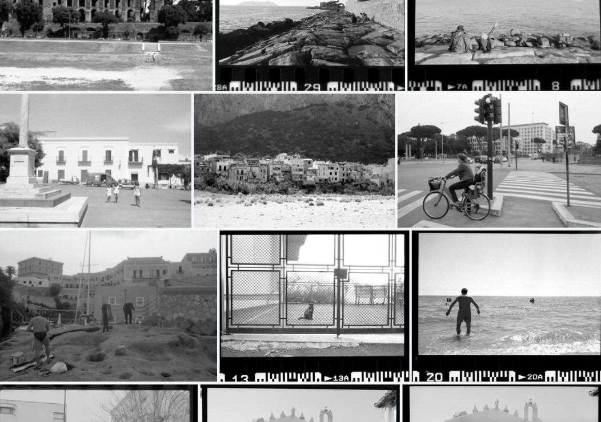

# con tutta la freschezza del banco frigo  

  

provo a scrivere qualcosa su la Natura anzi su cosa pensiamo si debba pensare per Natura 

**FAQ**  
- [la natura è da per tutto?](https://drive.google.com/file/d/17h0n4lHaUZwJltsiBW8Cvu32hG6gSe5I/view?usp=sharing) : sì, abbastanza  
- [qual è il contrario di natura](https://drive.google.com/file/d/1vAQ6it1CuOIChibJOhWO60WpLLbxGgTB/view?usp=share_link)  
- [cosa ti ispira fare nella natura](https://drive.google.com/file/d/1QTrv9slrFS454PlxkNezlzRlUdrLEWA0/view?usp=share_link)  
- [in natura ogni cosa finisce?](https://drive.google.com/file/d/1_6sRRJu-o7eiE_2U4pEmQt0SI3bOd4GA/view?usp=share_link)  
- [perché modifichiamo la natura?](https://drive.google.com/file/d/1DZa0biWAfTqyXuVm5DUM0Qwe1yVmSDoD/view?usp=share_link)  
- [la tecnologia è più intelligente della natura?](https://drive.google.com/file/d/14Kxks4R3SRauvhy3WmktK5rT8MQ1TkWa/view?usp=share_link)  
- [cosa possiamo imparare dalla natura?](https://drive.google.com/file/d/1uwjU15ZKQDPPVGvCbevkRZQ8lJXNWTRl/view?usp=share_link)  
- [cosa fai per capire che qualcosa è vivo](https://drive.google.com/file/d/1Q8zrxDrOx8R2_UqxUiltobtAoACcsLwt/view?usp=share_link)  
- [ogni essere vivente ha capacità speciali?](https://drive.google.com/file/d/19i3sgdXDrzSQZWPkZEu2O0mObHaLodAG/view?usp=share_link)  
- [quale domanda vorresti fare ad un animale?](https://drive.google.com/file/d/1XCWHjIkrXTx2z9lutxEho_ZDN1A_HiOP/view?usp=share_link)  
- [gli animali ci capiscono?](https://drive.google.com/file/d/19J_Cg7drvECFaME0bW228LOvSL0tKdcZ/view?usp=share_link)  
- [gli animali possono fidarsi di noi?](https://drive.google.com/file/d/1GKvkfRE1e46s8E4Ul7QEn4lXgo4dmqMb/view?usp=share_link)  
- [gli animali hanno le nostre stesse paure?](https://drive.google.com/file/d/1h5ntYbFVkCsjOQWLhe3W54uc-dKy_Q2S/view?usp=share_link)  
- [essere un animale domestico ha dei vantaggi?](https://drive.google.com/file/d/16YMXQiJRNDthtC4MBVvDcnVE6N5tF24n/view?usp=share_link)  
- [cosa ti piacerebbe fare che solo un animale sa fare?](https://drive.google.com/file/d/1q8v0Ko1WHLYcyuFbpsWdZmgAfbWEDdJz/view?usp=share_link)  

**Incontri ravvicinati**  
- [creoce del sub](drn-001.md) : abstract

**YYY**  
 
- [titolo titolo 2](drn-001.md) : dove si parla di bla bla bla  
- [titolo titolo 3](drn-001.md) : dove si parla di bla bla bla  

---    
[about me](https://about.me/cacioman)  
