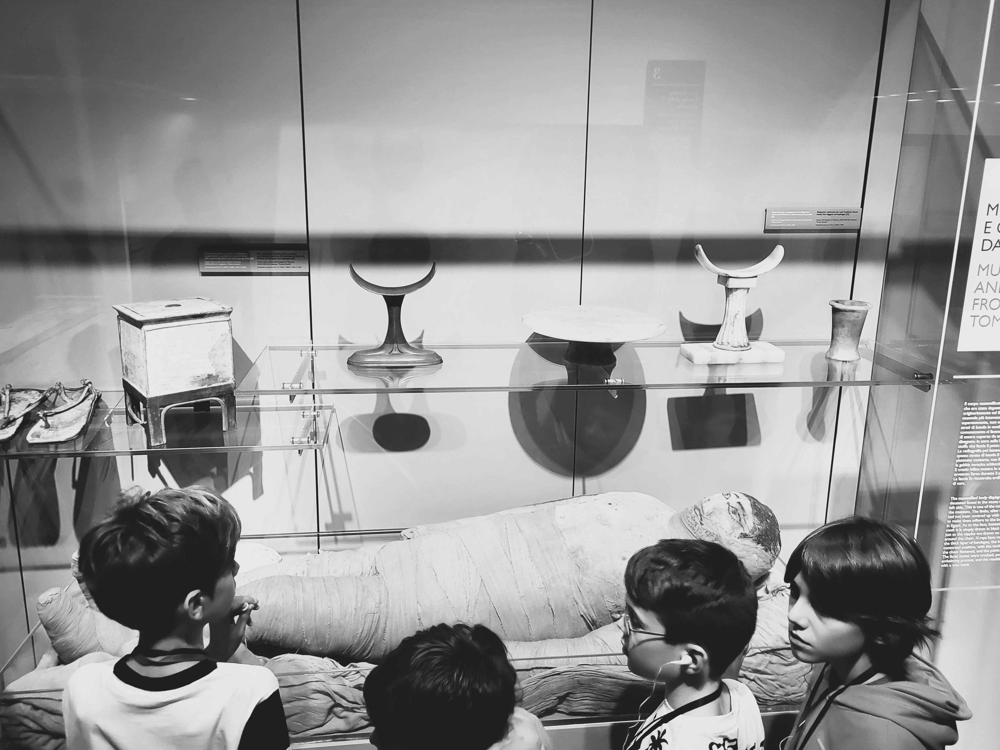

# nonno mongo
### della serie "in giro" - nov/24

  

Per delle pratiche sono andato ad un ufficietto distaccato che dà sull’esterno e bisogna suonare per farsi aprire. C'è una signora sui quarantacinque che apre subito, msempr emolto gentiel. Prima di entrare mi fermo su un appoggio di fianco alla porta e preparo le mie carte. Facendo così non posso però non sentire che dentro la solita gentilissima signora è li che urla al telefono: “Nonno è un mongoloide! Nonno è un mongoloide!”  
Più accorata che arrabbiata: “Amore mio se mamma te dice che nonno è un mongoloide è perchè nonno ha fatto del male a nonna, e pure a mamma, e perchè nonno è un mongoloide!”  
Esito a bussare. Quella dentro continua.  
“Mamma non è cattiva: è nonno che è un mongolide!”  
A questo punto busso. Mi aprono subito. Ritiano le pratiche, occhi curvi, un filo di imbarazzo ma sempre gentilissima.  
Ci salutiamo, esco e come la porta si chiude che alle mie spalle già sento: “Nonno è un mongoloide, un mongoloide capito!”  

---  
[about me](https://about.me/cacioman) 
