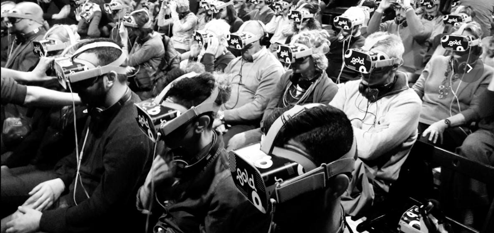

# navigare a vista    

Per un [laboratorio di foto narrazione](https://roma.officinefotografiche.org/corsi/metamorfosi/) sul tema "Metamorfosi", ho raccolto una selezione di foto che ho fatto dalla pandemia a oggi e aggiunto due righe per raccontare il cambiamento, più o meno grande, che quelle immagini mi ricordano.    
Le immagini messe così [nello loro sequenza](https://flic.kr/s/aHBqjAuLZN) c'avrebbero pure una specie di logica intrinseca, ma molto evanescente.  
**Clicca sulle immagini qui sotto e parte il testo corrispondente.**  

----  

            
 
 
   

    

---    
[about me](https://about.me/cacioman)  
